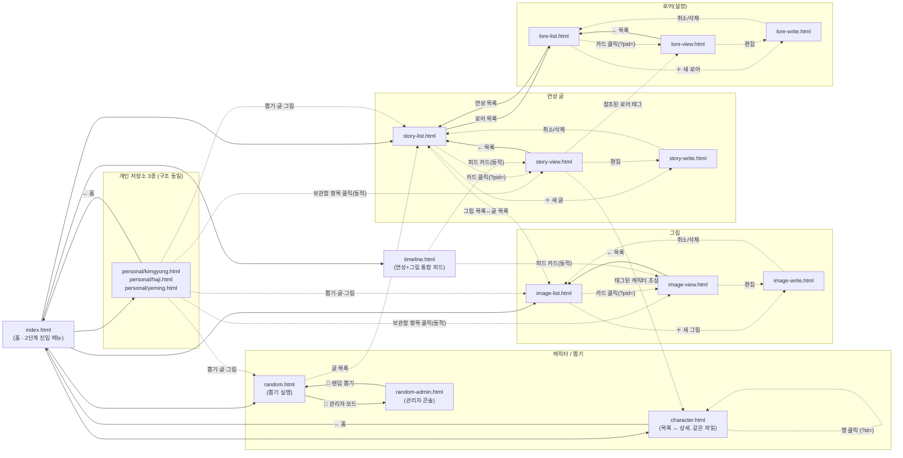

> 코드 구조·모듈 의존 관계는 `RESTRUCTURE-REVIEW.md`에 이미 정리돼 있어 여기서는 다루지 않는다. 이 문서는 오직 **사용자가 실제로 클릭해서 이동하는 동선**과 **화면에서 할 수 있는 일**만 본다. `public/` 아래 18개 HTML 전부(및 전역 주입 스크립트 `personal-nav.js`)의 `<a href>`, `location.href`, 버튼 핸들러를 코드 레벨에서 추적해 작성했다.

## ① 페이지 간 이동 그래프

**고아(순수 미링크) 페이지는 없다.** `404.html`(정적 호스트가 매칭 실패 시 자동으로 띄우는 페이지)을 빼면, 18개 페이지 전부 최소 한 경로로는 링크를 타고 도달 가능하다. 다만 도달 경로의 "깊이·눈에 띄는 정도"는 페이지마다 크게 다르다.

- **낮은 발견성(도달은 가능하지만 우연히 마주치기 어려움)**
  - `random-admin.html` — 진입점이 `random.html` 하단의 다른 필 버튼들과 나란히 있는 "🔧 관리자 모드" 하나뿐. `index.html` 홈 메뉴에는 아예 없음.
  - `story/lore-list.html` — `index.html` 홈 메뉴에 없고, `story-list.html` 안의 보조 링크로만 존재. 로어 콘텐츠 자체가 캐릭터 설정 옆이 아니라 "연성 글" 하위 개념처럼 취급됨.
  - `story/timeline.html` — 홈에서만 진입 가능하고 `story-list.html`/`image-list.html`과는 서로 링크되어 있지 않아, 목록 화면들의 클러스터와 완전히 분리된 섬 형태.
- **탐색 동선의 막다른 길(dead end)**: `story-write.html`/`image-write.html`/`lore-write.html`은 저장(`API.createStory`/`updateStory` 등) 성공 후에도 화면 전환이 없다 — 토스트만 뜨고 그대로 작성 화면에 남는다(`bottomActions`에도 "삭제" 버튼만 있고 "보러가기" 링크는 없음). 방금 쓴 글/그림/로어를 실제로 확인하려면 "← 목록"으로 나가서 목록에서 카드를 다시 찾아 들어가야 한다 — 저장 직후 결과로 바로 넘어가는 경로가 세 작성 페이지 모두에 없다.

## ② 페이지별 기능 인벤토리

| 페이지 | 주요 기능 | 숨은 / 조건부 기능 |
|---|---|---|
| `index.html` | 2단계 진입 메뉴(① 뽑기·캐릭터·개인저장소·연성 카테고리 선택 → ② 세부 대상 선택) | "개인 저장소" 카드를 눌러야만 유저 3명 선택지가 나타남(`userLinks`, 기본 `display:none`) |
| `character.html` | 목록: 서브그룹별 3열 카드, "설정순" 정렬 버튼. 상세: 정보 필드, 커스텀 섹션, 대표 이미지 | **편집 버튼**은 상세 화면에서만 노출(`editToggle`, 목록에선 `display:none`); 편집 모드 진입 시 대표 이미지 업로드/삭제 버튼이 그제서야 나타남 |
| `random.html` | 인원수 선택, 오너/그룹별 캐릭터 풀 선택, 성별·솔로·커플 필터, 뽑기 실행, 결과 복사/저장소 저장, 역할·관계성 리롤 | "캐릭터 설정 전체 확인"/"관계성 전체 확인" 리스트 모달(뽑기 풀과 별개로 전체 태그 열람용, 눈에 잘 안 띄는 보조 버튼) |
| `random-admin.html` | 오너/그룹/캐릭터 트리 CRUD, 순서 변경(▲▼), 오너·그룹 이동, ID 일괄 부여 | **탭 2개가 사실상 별개 기능**: "캐릭터 설정"(역할) 탭·"관계성"(AU) 탭 — 뽑기 캐릭터 관리와 무관한 태그 어휘 편집이 같은 화면에 얹혀 있음(③ 참고) |
| `personal/{name}.html` ×3 | 뽑기 결과함(수정/삭제), 나중에 볼 글, 스토리 보관함 — 탭 전환 | 동일 |
| `story/story-list.html` | 텍스트 검색(Enter 지원), 카드 목록, 새 글 작성 | — |
| `story/story-view.html` | 챕터 열람(좌우 화살표 키보드 지원), 댓글 CRUD, 보관함 저장(`storage-modal`), 태그된 캐릭터 초상화 열(있으면 이미지, 없으면 이니셜) | 삭제/편집 버튼은 항상 노출(관리자 구분 없음 — 로그인 개념 자체가 없는 구조) |
| `story/story-write.html` | 제목/등급/태그(캐릭터·역할·AU)/로어 참조 선택, 챕터 추가·삭제, 저장, 뒤로가기 시 미저장 경고 | 신규(`?new=1`) 여부에 따라 삭제 버튼 영역 자체가 숨겨짐 |
| `story/image-list.html` | **태그 칩 필터만 존재, 텍스트 검색 없음**(story/lore와 비대칭 — ④ 참고), 새 그림 작성 | — |
| `story/image-view.html` | 챕터 열람(좌우 화살표), 댓글 CRUD, 보관함 저장, 편집/삭제 | — |
| `story/image-write.html` | 이미지 업로드(챕터별), 태그 입력(자동완성 제안), 챕터 삭제, 저장/삭제 | 태그 입력창 Enter/Escape 단축키 |
| `story/lore-list.html` | 텍스트 검색(Enter 지원), 카드 목록, 새 로어 작성 | — |
| `story/lore-view.html` | 챕터 열람(좌우 화살표), 목차 오버레이(`toc-overlay`), 편집/삭제 | **댓글도 보관함 저장 기능도 없음** — story/image와 달리 사교 기능이 전혀 없는 유일한 콘텐츠 타입(③/④ 참고). `confirm-modal.js`는 로드하지만 `storage-modal.js`는 애초에 로드 안 함 |
| `story/lore-write.html` | 챕터 추가·삭제, 저장/삭제, 뒤로가기 미저장 경고 | — |
| `story/timeline.html` | 무한 스크롤 피드(연성+그림 통합, 최신 수정순) | — |
| `personal-nav.js`(전역 위젯) | 좌하단 원형 버튼 → 유저 3명 팝업(모든 페이지 좌하단에 자가 주입) | `index.html`·`404.html`에는 이 위젯 자체가 없음(스크립트 미포함) |

## ③ 페이지 이름과 실제 역할의 괴리

- **`random-admin.html`** — 이름·`<h1>`(둘 다 "관리자 페이지")은 "뽑기 시스템의 관리자 기능" 정도로 읽히지만, 실제 탭 3개 중 2개(⚔️ 캐릭터 설정 = `oc_roles`, 🌀 관계성 = `oc_aus`)는 뽑기와 무관하게 연성 글 작성 시 쓰는 **태그 어휘 자체를 관리하는 화면**이다. `story-write.html`이 참조하는 역할/AU 마스터 데이터의 실질적인 편집 창구가 "뽑기 관리자" 안에 숨어 있는 셈 — 연성 글 쪽 사용자는 이 페이지의 존재조차 짐작하기 어렵다.
- **`character.html`** — 파일명·URL이 하나뿐이라 "목록"과 "상세"라는 서로 다른 화면 두 개를 한 이름이 가리킨다. `<title>`(문서 타이틀)은 고정이고 화면 내 `topTitle`만 "캐릭터 목록" / "캐릭터 설정"으로 바뀌는데, 뒤로가기 버튼의 라벨·동작까지 목록에선 "← 홈"(→`location.href`), 상세에선 "← 뒤로"(→`history.back()`)로 완전히 달라진다 — 같은 파일이 실질적으로 두 개의 서로 다른 페이지 역할을 겸하면서 뒤로가기 목적지가 문맥에 따라 달라지는 유일한 페이지.
- **`personal/{kimgyong,haji,yeming}.html`** — 이름만 보면 "개인 프로필/소개 페이지"처럼 읽히지만 실제로는 프로필 정보가 전혀 없고 **뽑기 결과함 + 나중에 볼 글 + 스토리 보관함, 3종 저장소의 뷰어**다. "개인 저장소"라는 실제 역할이 파일명에는 드러나지 않고 `index.html`의 진입 메뉴 라벨에서만 드러난다.
- **`story/timeline.html`** — "타임라인"이라는 이름은 시간 축 위에 사건을 배치한 연표를 연상시키지만, 실제 구현(`buildCardHtml`/`loadMore`)은 날짜 그룹핑도 시간 축 시각화도 없는 **연성 글+그림 통합 "최신 수정순" 무한 스크롤 피드**다(백엔드 `routes/feed.js`도 스스로를 "피드"로 부른다). 이름이 암시하는 연대기적 열람과 실제로 제공하는 SNS성 피드 열람 사이에 기대 차이가 생긴다.
- **`story-write.html`/`image-write.html`/`lore-write.html`** — "쓰기(write)"라는 이름과 달리 **생성·수정·삭제를 모두 겸하는 단일 편집 화면**이다(`?new=1`로 신규/기존을 나누고, 화면 안에 삭제 버튼까지 포함). "쓰기 전용"을 기대하고 들어온 사용자에게 삭제 동작까지 같은 화면·같은 버튼 그룹 안에 있다는 점은 파일명만으로는 예측되지 않는다.

## ④ UI 일관성

- **뒤로가기 링크의 위치가 화면 성격에 따라 갈린다.** `theme.css`의 `.nav-corner`(좌상단 고정)는 **목록/허브형 페이지**(`random.html`, `random-admin.html`, `character.html`, `image-list.html`, `lore-list.html`, `story-list.html`, `timeline.html`, `personal/*.html`)에서만 쓰이고, **상세/작성형 페이지**(`story-view.html`, `image-view.html`, `lore-view.html`, `story-write.html`, `image-write.html`, `lore-write.html`)의 "← 목록" 버튼은 같은 `.nav-link` 클래스이면서 `.nav-corner`가 빠져 있어 고정 위치가 아니라 본문 흐름 안의 인라인 요소로 렌더링된다 — 같은 "뒤로가기"인데 화면 종류에 따라 완전히 다른 자리에 있다.
- **뒤로가기의 목적지 결정 방식이 페이지마다 다르다.** 대부분의 상세 페이지는 고정된 목록 URL로 돌아가지만(`story-view.html` → `story-list.html` 등), `character.html`은 상세 모드에서만 유일하게 `history.back()`(브라우저 히스토리 의존)을 쓴다 — 다른 페이지에서 `character.html?id=`로 직접 딥링크해 들어온 경우 "뒤로" 버튼이 기대와 다른 곳으로 갈 수 있다.
- **"모달"이라는 이름 아래 시각적으로 서로 다른 3계열이 공존한다.** ① `confirm-modal.js`/`storage-modal.js`가 만드는 제네릭 확인·선택 모달(`cc-`/`sp-` 접두), ② `random.html`·`random-admin.html`이 각자 파일 안에 독립적으로 정의한 리본 장식 모달(`.modal-overlay`/`.modal-ribbon`/`.modal-exit`), ③ `index.html`만의 전체화면 진입 메뉴(`.enter-overlay`/`.modal-card`). 특히 ②는 공용 자산으로 뽑혀 있지 않아 `random.html`과 `random-admin.html` 두 파일에 사실상 같은 리본 모달 마크업/스타일이 각각 따로 존재할 가능성이 높다.
- **동기화 상태 배지 문구가 페이지군에 따라 다르다.** 대부분 페이지는 `sync-badge`에 "실시간 연결됨"이라 쓰는데, `personal/*.html` 3개만 "연결됨"(실시간 없이)으로 짧게 표기 — 같은 컴포넌트, 다른 카피.
- **목록 3형제(연성/그림/로어)의 필터 기능이 비대칭이다.** `story-list.html`과 `lore-list.html`은 텍스트 검색창(Enter로 검색)이 있는데, `image-list.html`은 태그 칩 필터만 있고 텍스트 검색 자체가 없다 — 세 목록이 카드 레이아웃은 비슷하게 맞춰져 있는데 정작 "찾는" 방법은 하나만 다르다.
- **콘텐츠 상세 3형제(연성/그림/로어)의 소셜 기능이 비대칭이다.** `story-view.html`·`image-view.html`은 댓글과 보관함 저장이 모두 있는데, `lore-view.html`은 둘 다 없다(대신 목차 오버레이가 있음). 화면 구조(챕터 탭, 편집/삭제 버튼 위치)는 셋이 거의 동일해서, 사용자 입장에선 로어 글에도 댓글·저장 버튼이 있어야 할 것처럼 보이는 자리에 아무것도 없다.

## IA 재편 방향 제안 (프레임워크 도입 없이, 정적 HTML 유지 전제)

**A. "허브를 진짜 허브로" — `index.html`에 관리자·로어 진입점을 노출하고, 저장 후 동선을 닫는다.**
`random-admin.html`과 `lore-list.html`을 홈 메뉴 1단계에 정식으로 올리거나(적어도 `random.html`/`story-list.html`의 눈에 띄는 자리로 승격), `story-write.html`/`image-write.html`/`lore-write.html`의 저장 성공 콜백에 "보러가기" 링크(또는 저장 후 뷰 페이지로 자동 이동)를 추가한다. 코드 변경 범위가 가장 작고(각 write 페이지의 저장 핸들러 3곳 + 홈 메뉴 링크 추가), 지금 가장 자주 부딪힐 만한 동선 문제(관리 기능 발견 못 함, 쓰고 나서 확인할 길이 없음)를 직접 없앤다.

**B. "동형 화면은 동형 컴포넌트로" — 상세/작성 페이지 헤더를 목록 페이지와 같은 `.nav-corner` 규약으로 통일하고, 로어를 story/image와 같은 소셜 기능 대상에 포함할지 결정한다.**
`theme.css`에 이미 있는 `.nav-corner`/`.page-hero` 규약을 상세·작성 페이지의 "← 목록" 버튼에도 그대로 적용해 위치 불일치를 없애고, `character.html`의 `history.back()`도 다른 페이지처럼 고정 목적지로 바꾼다. 로어에 댓글/보관함을 낼지 말지는 제품 판단이 필요하지만, 지금처럼 "이유 없이 빠짐"으로 보이는 상태보다는 명시적으로 결정하는 편이 낫다(DB 스키마의 `parent_type CHECK ('story','image')`도 같이 넓혀야 함 — 이 부분만 코드 구조 문서 쪽 작업).

**C. "저장소 3종을 하나의 개념으로 승격" — `personal/*.html` 통합과 함께, 명칭을 실제 역할에 맞춘다.**
`RESTRUCTURE-REVIEW.md`에서 이미 지적한 "personal 3파일 통합"과 맞물려서, IA 관점에서는 이 페이지군의 이름 자체를 "개인 저장소"/"보관함"류로 바꿔 파일명·타이틀·홈 메뉴 라벨을 일치시키는 것을 함께 검토할 만하다. 통합 시 유저를 쿼리 파라미터로 받게 되므로, 그 김에 `random-admin.html`처럼 홈 메뉴에 없는 페이지들의 진입 동선도 같이 정리하면 A안과 자연히 겹쳐서 한 번에 처리할 수 있다.
