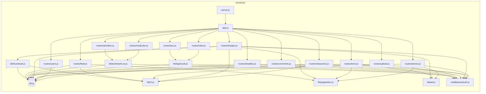
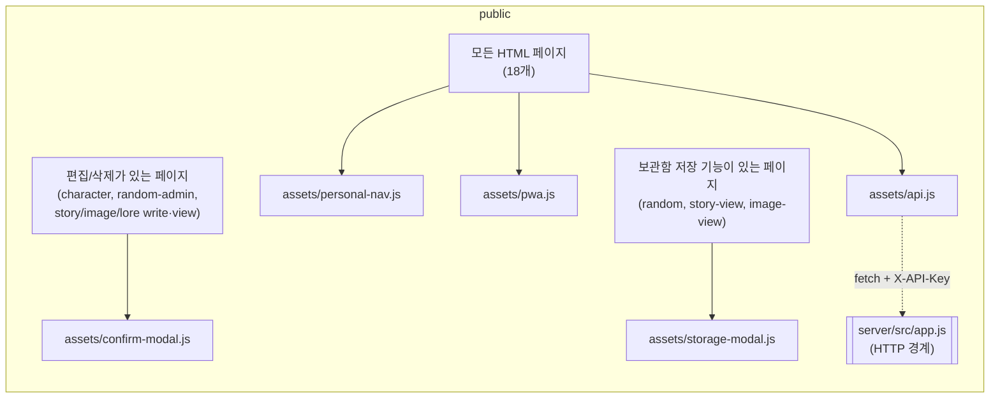

## ① 디렉토리 트리

```
oc-yeonsung/
├── firebase.json                      # Firestore/Hosting 시절 유물 (현재 배포와 무관, ④-6 참고)
├── server/
│   ├── ecosystem.config.js            # pm2 설정
│   ├── package.json                   # express/better-sqlite3/multer/sharp/@aws-sdk/client-s3 등
│   ├── DEPLOY.md                      # 수동 배포 런북 (Lightsail + nginx + pm2, git pull)
│   ├── nginx.oc-yeonsung.conf.sample
│   ├── migrate/                       # 1회성 Firestore → SQLite/R2 이관 스크립트
│   │   ├── firestore-export.js
│   │   ├── import-to-sqlite.js
│   │   └── migrate-images-to-r2.js
│   └── src/
│       ├── server.js                  # 진입점 (dotenv + app.listen)
│       ├── app.js                     # express 앱 조립 + 라우터 마운트
│       ├── db.js                      # better-sqlite3 연결 + 스키마 로드 + 컬럼 마이그레이션 + 유저 시드
│       ├── schema.sql                 # oc_* 테이블 전체 정의
│       ├── middleware/
│       │   └── auth.js                # requireApiKey (X-API-Key 헤더 검사)
│       ├── lib/
│       │   ├── r2.js                  # R2 업로드/삭제/공개 URL
│       │   ├── thumbnail.js           # sharp 썸네일 재생성
│       │   ├── pagination.js          # 커서 인코딩/디코딩, IN절 헬퍼
│       │   ├── pid.js                 # nanoid 기반 pid 생성
│       │   ├── tagVocab.js            # roles/aus 공용 라우터 팩토리
│       │   └── bookmarkList.js        # readLater/storyBox 공용 라우터 팩토리
│       └── routes/
│           ├── characters.js          # 캐릭터 트리 + 대표 이미지
│           ├── roles.js               # createTagVocabRouter 위임 (3줄)
│           ├── aus.js                 # createTagVocabRouter 위임 (3줄)
│           ├── users.js               # 고정 3인 사용자 목록
│           ├── stories.js             # 연성 글 CRUD + 캐릭터/역할/AU/로어참조 태깅
│           ├── lores.js               # 설정(로어) CRUD
│           ├── images.js              # 그림 갤러리 CRUD + 썸네일 트리거
│           ├── comments.js            # story/image 공용 댓글
│           ├── upload.js              # 그림 챕터 원본 이미지 업로드 (R2)
│           ├── feed.js                # 연성+그림 통합 최신순 피드
│           ├── drawBox.js             # createBookmarkListRouter 위임 (3줄)
│           ├── readLater.js           # createBookmarkListRouter 위임 (3줄)
│           └── storyBox.js            # createBookmarkListRouter 위임 (3줄)
└── public/                            # 정적 프론트 (프레임워크 없음, 공유 레이아웃/컴포넌트 계층 없음)
    ├── index.html                     # 랜딩
    ├── character.html                 # 캐릭터 상세/편집 (1,162줄)
    ├── random.html                    # 뽑기 (1,073줄)
    ├── random-admin.html              # 뽑기 관리자: 오너/그룹/캐릭터 트리 + 역할/관계성 (1,716줄)
    ├── 404.html
    ├── personal/
    │   ├── kimgyong.html              # 개인 저장소 (577줄, 3파일 사실상 동일본 — ④-2 참고)
    │   ├── haji.html
    │   └── yeming.html
    ├── story/
    │   ├── story-list.html / story-view.html(1,461) / story-write.html(1,181)
    │   ├── image-list.html / image-view.html / image-write.html
    │   ├── lore-list.html / lore-view.html / lore-write.html
    │   └── timeline.html
    └── assets/
        ├── api.js                     # 백엔드 API 클라이언트 (window.API, fetch 래퍼)
        ├── personal-nav.js            # 좌하단 개인 저장소 바로가기 위젯 (자체 주입 스타일 포함)
        ├── confirm-modal.js           # 공용 확인 모달 (window.customConfirm)
        ├── storage-modal.js           # 공용 저장소 선택 모달 (window.openStoragePicker)
        └── pwa.js                     # 서비스워커 등록
```

## ② 모듈별 책임 (한 줄 요약)

### 백엔드 (`server/src`)

| 모듈 | 책임 |
|---|---|
| `server.js` | dotenv 로드 후 Express 앱을 포트에 바인딩하는 진입점 |
| `app.js` | 미들웨어 조립 + 13개 라우터를 경로에 마운트, 최종 에러 핸들러 |
| `db.js` | better-sqlite3 연결, `schema.sql` 실행, 사후 컬럼 추가(`ensureColumn`), 고정 3인 유저 시드 |
| `schema.sql` | `oc_` 프리픽스 전체 테이블/인덱스 정의 (shared.db를 포켓리스 앱과 공유하기 때문) |
| `middleware/auth.js` | `X-API-Key` 헤더를 `process.env.API_KEY`와 비교하는 단일 게이트 |
| `lib/r2.js` | R2(S3 호환) 클라이언트 래퍼 — 업로드/삭제/버퍼 조회/공개 URL(+캐시버스팅 `?v=`) 생성 |
| `lib/thumbnail.js` | 지정된 챕터 원본을 R2에서 읽어 sharp로 썸네일 재생성 후 재업로드 |
| `lib/pagination.js` | `updated_at:pid` 커서 인코딩/디코딩, SQL `IN(...)` 플레이스홀더, CSV 파라미터 분리 |
| `lib/pid.js` | nanoid 8자 소문자+숫자 pid 생성기 |
| `lib/tagVocab.js` | "그룹 목록 안에 라벨 목록" 트리를 통째로 읽고 쓰는 라우터 팩토리 (roles/aus가 공유) |
| `lib/bookmarkList.js` | "유저별 story/image 북마크" 라우터 팩토리 (readLater/storyBox가 공유) |
| `routes/characters.js` | 오너→서브그룹→캐릭터 트리 CRUD, 개별 캐릭터 패치, 대표 이미지 업로드/삭제 |
| `routes/roles.js`, `routes/aus.js` | `createTagVocabRouter`를 각자 테이블 이름으로 호출만 하는 3줄 위임 라우터 |
| `routes/users.js` | 고정 3인 유저 목록 조회 (읽기 전용) |
| `routes/stories.js` | 연성 글(pid) + 챕터 + 캐릭터/역할/AU 태그 + 로어 참조 CRUD, 커서 페이지네이션 |
| `routes/lores.js` | 설정(로어) 글 + 챕터 CRUD, 커서 페이지네이션 |
| `routes/images.js` | 그림 갤러리(pid) + 챕터 + 캐릭터/태그 CRUD, 저장 시 고아 R2 오브젝트 정리 + 썸네일 재생성 트리거 |
| `routes/comments.js` | story/image 공용 댓글 CRUD, 부모 문서의 `comment_count` 증감 |
| `routes/upload.js` | 그림 챕터 원본 이미지를 R2에 업로드 (20MB 제한) |
| `routes/feed.js` | `oc_stories`/`oc_images`를 `UNION ALL`로 합쳐 최신 수정순 커서 페이지네이션 피드 제공 |
| `routes/drawBox.js` | 유저별 "뽑기 결과" 저장 CRUD (`bookmarkList`와 구조는 같지만 스키마가 달라 별도 구현) |
| `routes/readLater.js`, `routes/storyBox.js` | `createBookmarkListRouter`를 각자 테이블 이름으로 호출만 하는 3줄 위임 라우터 |

### 프론트엔드 (`public`)

| 모듈 | 책임 |
|---|---|
| `assets/api.js` | 유일한 백엔드 게이트웨이 — 모든 `/api/*` 호출과 하드코딩된 `X-API-Key`를 감싼 `window.API` |
| `assets/personal-nav.js` | 모든 페이지 좌하단에 자가 주입되는 "개인 저장소 바로가기" 원형 버튼+팝업 (스타일도 JS 안에서 주입) |
| `assets/confirm-modal.js` | `window.customConfirm(message) → Promise<boolean>` 공용 확인 모달 |
| `assets/storage-modal.js` | `window.openStoragePicker({...}) → Promise` 공용 유저/보관함 선택 모달 |
| `assets/pwa.js` | 서비스워커(`/sw.js`) 등록 한 줄짜리 |
| `character.html` | 캐릭터 목록/상세/편집 페이지 (대표 이미지, 커스텀 섹션, 관리자 모드 겸용) |
| `random.html` | 캐릭터 뽑기 실행 화면 |
| `random-admin.html` | 오너/그룹/캐릭터 트리 관리자 + 역할/관계성(AU) 태그 관리 |
| `personal/{kimgyong,haji,yeming}.html` | 유저별 개인 저장소(뽑기함/나중에 볼 글/보관함) — 3파일이 유저 3줄만 다름 |
| `story/story-*.html` | 연성 글 목록/읽기/작성 |
| `story/image-*.html` | 그림 갤러리 목록/보기/작성 |
| `story/lore-*.html` | 설정(로어) 목록/보기/작성 |
| `story/timeline.html` | 통합 타임라인(피드) 뷰 |

## ③ 모듈 간 의존 관계

**순환 의존은 없음** — 백엔드는 `routes → lib → db`, 프론트는 `page.html → assets/*.js` 로 항상 한 방향이며, 어떤 `lib`도 `routes`를 되돌아 참조하지 않고 어떤 공용 `assets/*.js`도 특정 페이지를 참조하지 않는다.





프론트-백엔드 경계는 `assets/api.js` 하나로 완전히 좁혀져 있고(모든 페이지가 이 파일만 거쳐 `/api/*`를 호출), 역방향 참조(백엔드가 프론트를 아는 경우)는 존재하지 않는다.

## ④ 구조적으로 아쉬운 지점

1. **`replaceTree`류 delete-and-reinsert 패턴이 스키마 차원에서 아직 위험을 깔고 있음.** `oc_characters.id`가 저장할 때마다 재배정되던 버그(CLAUDE.md 2026-08-17 "후속2")는 `characters.js`만 UPSERT로 고쳤을 뿐, `oc_characters.id`가 여전히 `INTEGER PRIMARY KEY`(AUTOINCREMENT 아님)라는 근본 조건과 `lib/tagVocab.js`의 `replaceTree`(`DELETE` 전체 → 재`INSERT`)는 그대로 남아있다. 지금은 `oc_roles`/`oc_aus`의 id를 외부에서 참조하는 곳이 없어 안전하지만, 나중에 역할/AU에 id 참조(예: 캐릭터별 즐겨찾기, 딥링크)를 추가하는 순간 캐릭터에서 이미 겪은 "다른 레코드로 조용히 오염" 버그가 그대로 재현될 수 있는 구조다. 재구조화 시 `schema.sql`에 `AUTOINCREMENT`를 붙이거나, delete-and-reinsert 패턴 자체를 팩토리 수준에서 UPSERT로 통일해두는 게 안전하다.

2. **`public/personal/{kimgyong,haji,yeming}.html`이 각 577줄짜리 완전 복사본.** 세 파일의 차이는 `<title>`, `<h1>` 아이콘, `USER_NAME` 상수 3줄뿐(`diff` 12줄)이다. 약 1,150줄이 오직 유지보수 비용으로만 존재 — 쿼리 파라미터(`personal.html?user=하지`) 하나로 통합 가능한 구조인데, 라우팅 계층이 없는 정적 사이트 특성상 "파일 = URL"이 되면서 복붙이 선택됐던 것으로 보인다. 페이지 하나를 고칠 때마다 세 곳을 동일하게 고쳐야 하는 부담이 계속 누적된다.

3. **동일 CRUD 패턴에 대한 추상화가 절반만 적용됨.** `roles`/`aus`는 `createTagVocabRouter`로, `readLater`/`storyBox`는 `createBookmarkListRouter`로 각각 팩토리화했지만, 정작 가장 비슷한 세 라우트인 `stories.js`(193줄)·`lores.js`(97줄)·`images.js`(173줄)는 "pid + 챕터 + 태그/캐릭터 연결 + 커서 페이지네이션 + `attachRelations`/`toJson`" 패턴을 셋 다 독립적으로 재구현하고 있다. `drawBox.js` 역시 `bookmarkList.js`와 거의 동일한 `getUser(name)` 3줄짜리 헬퍼를 그대로 다시 정의한다. DRY를 적용할 기준(스키마가 정확히 같으면 팩토리, 조금이라도 다르면 통 복붙)이 라우트마다 다르게 적용된 상태라, 다음에 "북마크 계열에 필드 하나 추가" 같은 변경이 오면 `drawBox.js`만 빠뜨리기 쉽다.

4. **R2 관련 에러 처리 계약이 `lib/r2.js` 안에서부터 일관되지 않고, 그 결과가 호출부마다 다른 방식으로 드러남.** `deleteObject`는 함수 내부에서 실패를 삼키고(`best-effort`), `uploadObject`/`getObjectBuffer`는 그대로 던진다. Express 4가 async 핸들러의 reject를 자동으로 잡아주지 않는다는 사실(CLAUDE.md에 두 차례— `characters.js` portrait, `upload.js` — 사고 후 개별 패치로 기록됨)과 맞물려서, "이 라우트가 R2 실패 시 502를 내려주는가"가 라우트별로 실제 실행해서 확인하기 전에는 코드만 봐서 예측하기 어렵다. 지금 `images.js`의 `POST/PUT/DELETE`는 우연히 안전하다(호출하는 `deleteObject`/`regenerateImageThumbnail` 둘 다 내부에서 에러를 삼키기 때문) — 하지만 이건 설계된 안전성이 아니라 마침 그렇게 된 것이라서, 다음에 이 라우트들에 `uploadObject` 호출이 하나라도 추가되면 같은 클래스의 버그가 세 번째로 재발할 소지가 있다. `express-async-errors`(또는 공용 `asyncHandler` 래퍼) 하나를 `app.js`에 넣으면 이 클래스의 버그 자체가 원천적으로 사라진다.

5. **공유 CSS/컴포넌트 레이어가 전혀 없어, 순수 색상 리터럴까지 파일마다 복붙된다.** 예를 들어 성별별 아바타 그라디언트(`.female { linear-gradient(135deg, #d4889e, #c0899e) }` / `.male {...#7ba0c4, #5a82a8...}`)가 `character.html`에 두 번(목록 카드용/상세용), `story-view.html`에 한 번, 정확히 같은 헥스값으로 그대로 박혀 있다. "프레임워크 없이 순수 HTML/JS"라는 선택 자체는 이 프로젝트 규모에 맞는 합리적 결정이지만, 최소한의 `assets/*.css` 공용 파일 하나 없이 18개 HTML이 각자 `<style>` 블록을 통째로 들고 있어서, 팔레트 값 하나를 바꾸려면 몇 개 파일에 흩어져 있는지부터 grep해야 한다.

6. **`firebase.json`이 리포 루트에 죽은 설정으로 남아있음.** 이 프로젝트는 이미 SQLite+R2로 이관 완료했고 배포는 Lightsail+nginx+pm2 수동 런북(`DEPLOY.md`)인데, `firebase.json`(Firestore/Firebase Hosting 시절 유물, `hosting.public: "public"`만 지정)은 그대로 남아있다. 지금 당장 문제를 일으키진 않지만, 누군가 무심코 `firebase deploy`를 실행하면 정적 파일이 이미 안 쓰는 Firebase Hosting 프로젝트로 올라가버리는 혼동의 여지가 있다.

7. **`random-admin.html`(1,716줄) 안에 예전 프로덕션 데이터가 그대로 굳어진 정적 마크업 스냅샷이 박혀 있음.** `renderChars()`(실제 동작하는 템플릿 함수)와 별개로 파일 앞쪽 300~950번대 줄에 페이지 로드 즉시 JS가 덮어쓰는 죽은 HTML 블록이 있다 — 기능상 문제는 없지만(CLAUDE.md에도 이미 "다음에 이 파일을 크게 손볼 일이 있으면 정리 고려" 로 기록돼 있음), 실제 데이터와 다른 내용이 소스에 남아 있어 파일을 처음 보는 사람에게 혼동을 준다.

8. **대형 단일 파일 경향.** `random-admin.html`(1,716) / `story-view.html`(1,461) / `story-write.html`(1,181) / `character.html`(1,162) 등 마크업·스타일·로직이 한 파일에 전부 들어있는 페이지가 여럿이고, 한 세션의 작업 로그(CLAUDE.md)만 봐도 매번 이 파일들에 기능이 계속 누적되는 추세다. 프레임워크 도입까지는 필요 없어 보이지만, 최소한 "이니셜 아바타 렌더링", "포트레이트 원형/그라디언트" 같이 이미 3곳 이상에서 복붙된 조각들만이라도 작은 `<script>` 유틸(예: `assets/avatar.js`)로 뽑아두면 파일이 커지는 속도를 늦출 수 있다.
